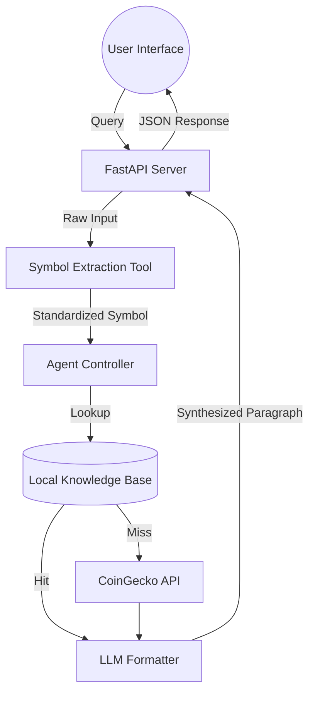

# 💠 Crypto Nexus | Advanced AI Intelligence Node

**Crypto Nexus** is a premium, high-performance cryptocurrency intelligence platform designed to provide strictly factual, real-time data analysis. Built with a modern **FastAPI** backend and a futuristic **Cyberpunk-inspired** frontend, it leverages **Large Language Models (LLMs)** to synthesize complex market data into professional financial summaries.

---

## 🌌 Project Vision

The goal of Crypto Nexus is to bridge the gap between complex blockchain data and human-readable insights. By combining a verified local knowledge base with live API fallbacks, the system ensures that users always receive factual information, specifically avoiding the "hallucination" issues common in standard LLM implementations.

---

## ✨ Key Features

### 🧠 Intelligence & Logic
- **Natural Language Understanding (NLU)**: Users can query in plain English (e.g., *"What's the future scope of Ethereum?"*). The system automatically extracts symbols using an LLM-powered pre-processor.
- **Dual-Data Sourcing**:
    - **Tier 1 (Knowledge Base)**: Instant lookup in a curated, high-accuracy JSON database.
    - **Tier 2 (CoinGecko Fallback)**: Automated live API retrieval if the asset isn't in the local KB.
- **Factual Synthesis**: An LLM (Qwen2/Mistral) processes the raw data points into a single, professional paragraph, ensuring no outside information is added.

### 🎨 Futuristic UI/UX
- **Cinematic Experience**: A high-definition, loopable blockchain video background with a custom radial blur overlay.
- **Glassmorphism**: UI panels use sophisticated backdrop-filter bluring for a high-end, futuristic feel.
- **Real-time Status**: Live monitoring of the Neural Engine, Knowledge Base, and API connections.
- **Holographic Feedback**: Animated typing indicators and "Neural Stream" processing effects.

---

## 🏗️ Architecture



---

## 🛠️ Technical Stack

- **Backend Framework**: [FastAPI](https://fastapi.tiangolo.com/) (Python 3.9+)
- **LLM Orchestration**: [LangChain](https://www.langchain.com/)
- **Local Inference**: [Ollama](https://ollama.com/) (Running Qwen2:1.5b)
- **Frontend**: Vanilla JS (ES6+), CSS3 (Modern Glassmorphism), HTML5
- **Data APIs**: CoinGecko REST v3

---

## 📦 System Setup

### 1. Prerequisites
- **Python**: Version 3.9 or higher.
- **Ollama**: Required for local AI processing.
    - Download at [ollama.com](https://ollama.com/).
    - Pull the default model: `ollama pull qwen2:1.5b`.

### 2. Environment Configuration
Create a `.env` file in the root directory (optional but recommended for custom LLM configs):
```env
MODEL_NAME=qwen2:1.5b
API_PORT=8000
```

### 3. Installation
Clone the repository and install dependencies:
```bash
git clone https://github.com/SyedSarimAbbas/crypto-nexus.git
cd crypto-nexus
pip install -r requirements.txt
```

### 4. Direct Execution
Start the Intelligence Node:
```bash
python app.py
```
The node will be operational at `http://localhost:8000`.

---

## 📁 Directory breakdown

- `app.py`: The central hub serving the API and the Nexus frontend.
- `agent/`: Contains the logic for the `crypto_agent`, managing the decision flow.
- `tools/`:
    - `input_processor.py`: LLM logic to convert sentences into symbols.
    - `kb_tool.py`: Logic for local database retrieval.
    - `crypto_api_tool.py`: Wrapper for the CoinGecko live data stream.
    - `llm_explainer.py`: The "Synthesizer" that turns data into paragraphs.
- `static/`:
    - `index.html`: The core UI structure.
    - `styles.css`: The futuristic design engine.
    - `script.js`: Client-side logic for real-time interaction.
- `data/`: Curated `crypto_kb.json` file containing foundational coin data.

---

## 🛡️ Operational Guidelines

- **Factual Rigor**: The agent is programmed to say "Information not available" if data is missing, rather than guessing.
- **Speed**: Local KB lookups are sub-millisecond; API and LLM synthesis usually complete within 1-2 seconds.
- **Privacy**: Since it uses Ollama, your queries are processed locally on your machine.

---

## ⚖️ License

This project is licensed under the **MIT License**. See the [LICENSE](file:///d:/Agentic%20AI/AI_Agent_Practice/LICENSE) file for details.

---
*© 2026 Crypto Nexus Made by Syed Sarim Abbas*
